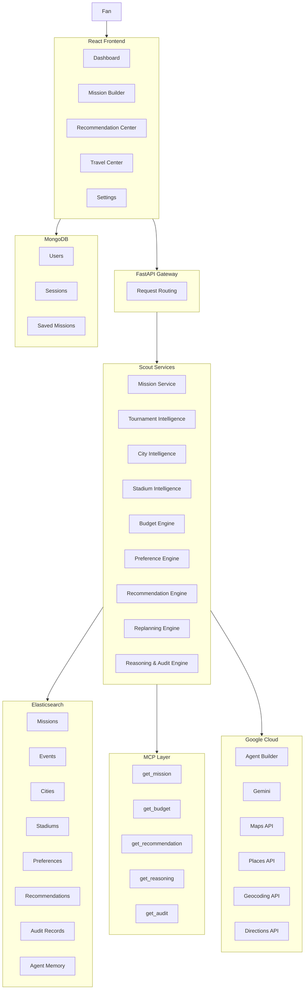
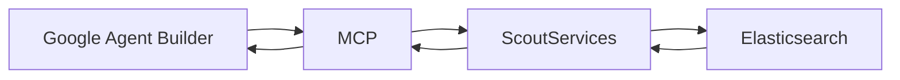
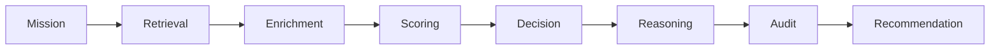

# ⚽ SKAUT

### Adaptive Tournament Intelligence Platform

**Mission In. Intelligence Out.**

Skaut is an AI-powered tournament intelligence platform that helps fans follow their team through uncertain tournaments such as the FIFA World Cup.

Unlike traditional travel planners that assume certainty, Skaut continuously monitors tournament developments, understands fan goals and constraints, and automatically replans missions when reality changes.

Built for the **Google Cloud Rapid Agent Hackathon 2026**.

---

# 🚀 The Problem

The FIFA World Cup is unpredictable.

A team advances.

A match changes cities.

Travel costs change.

Hotels disappear.

Routes become invalid.

Traditional travel tools force users to start over.

Fans don't need another booking website.

They need an intelligent system that adapts with the tournament.

---

# 💡 Our Solution

Skaut treats travel planning as a living mission.

Users define:

* Team
* Budget
* Travel Style
* Preferences

Skaut then:

* Monitors tournament developments
* Tracks mission state
* Detects impactful events
* Re-evaluates travel options
* Generates recommendations
* Explains every decision
* Adapts automatically

---

# 🏆 Why It Matters

The 2026 FIFA World Cup will include:

* 48 Teams
* 104 Matches
* 16 Host Cities
* Millions of Traveling Fans

Every advancement creates cascading travel challenges.

Skaut transforms those disruptions into actionable intelligence.

---

# 🎯 Key Features

## Adaptive Mission Planning

Create missions instead of static trips.

```text
Egypt Fan
↓
Budget: $3000
↓
Travel Style: Balanced
↓
Follow Team Through Tournament
```

As tournament conditions change, Skaut automatically adapts.

---

## Tournament Intelligence

Continuously tracks:

* Team advancement
* Match changes
* Venue changes
* Tournament progression

---

## Budget Intelligence

Evaluates:

* Travel burden
* Hotel affordability
* Destination costs
* Budget risk

Every recommendation is constrained by real user budgets.

---

## Recommendation Engine

Deterministic recommendation pipeline:

```text
Mission
↓
Semantic Retrieval
↓
Candidate Enrichment
↓
Preference Scoring
↓
Budget Analysis
↓
Decision Engine
↓
Recommendation
```

---

## Explainable AI

Every recommendation includes:

* Reasoning
* Audit trail
* Score contributions
* Budget impact

Users understand exactly why a recommendation was made.

---

## Travel Intelligence

Powered by Google Maps Platform.

Provides:

* Routes
* Distances
* Travel Time
* Hotels
* Restaurants
* Attractions
* Stadium Locations

---

# 🏗️ System Architecture



---

# 🤖 Agent Architecture

Google Cloud Agent Builder orchestrates workflows.

Agent Builder never owns business logic.

Scout owns all intelligence.



---

# 🔍 MCP Tool Catalog

| Tool                 | Purpose              |
| -------------------- | -------------------- |
| get_mission          | Retrieve mission     |
| get_mission_history  | Mission timeline     |
| search_cities        | Semantic city search |
| get_city             | City intelligence    |
| search_stadiums      | Stadium retrieval    |
| get_stadium          | Stadium intelligence |
| get_budget           | Budget analysis      |
| get_preferences      | User preferences     |
| get_team_status      | Team state           |
| get_tournament_state | Tournament state     |
| get_recommendation   | Recommendation       |
| get_reasoning        | Explanation          |
| get_audit            | Audit trail          |

---

# 🧠 Recommendation Pipeline



---

# 🗺️ Google Cloud Integration

## Agent Builder

Orchestrates multi-step workflows.

## Gemini

Generates:

* Explanations
* Summaries
* Narratives

## Google Maps Platform

Provides:

* Maps
* Places
* Directions
* Geocoding

---

# 📊 Data Architecture

## Elasticsearch (Source of Truth)

Stores:

* Missions
* Events
* Cities
* Stadiums
* Preferences
* Recommendations
* Audit Records
* Agent Memory

## MongoDB

Stores only:

* Users
* Sessions
* Saved Missions

---

# 🔒 Design Principles

### Deterministic Recommendations

Recommendations are generated by Scout.

Not by Gemini.

Not by Agent Builder.

---

### Explainable Decisions

Every recommendation can be traced back to:

* Inputs
* Scores
* Constraints
* Audit Records

---

### Adaptive Planning

Tournament changes trigger:

```text
Event
↓
Detection
↓
Mission Retrieval
↓
Replanning
↓
New Recommendation
```

Automatically.

---

# ☁️ Deployment

Frontend

* React
* Cloud Run

Backend

* FastAPI
* Cloud Run

Infrastructure

* Google Cloud
* Secret Manager
* Artifact Registry

Search & Intelligence

* Elasticsearch

Identity

* MongoDB

---

# 🏅 Hackathon Alignment

## Technological Implementation

✓ Google Cloud Agent Builder

✓ Gemini

✓ MCP Architecture

✓ Elasticsearch Vector Search

✓ Google Maps Platform

✓ Cloud Run Deployment

---

## Design

✓ Mission-Oriented UX

✓ Explainable AI

✓ Transparent Recommendations

✓ Adaptive Planning

---

## Potential Impact

✓ Millions of World Cup Fans

✓ Real Tournament Use Cases

✓ Autonomous Replanning

✓ Scalable Architecture

---

## Quality of Idea

✓ Solves a Real Problem

✓ Beyond Traditional Travel Apps

✓ Beyond Chatbots

✓ Agent-Driven Decision Making

---

# 🎬 Demo Flow

```text
Mission Creation
↓
Tournament Event
↓
Automatic Replanning
↓
Recommendation Generation
↓
Reasoning
↓
Travel Intelligence
↓
Mission Updated
```

---

# 👥 Team

Built for the Google Cloud Rapid Agent Hackathon 2026.

---

# ⚡ Tagline

Mission In.

Intelligence Out.
