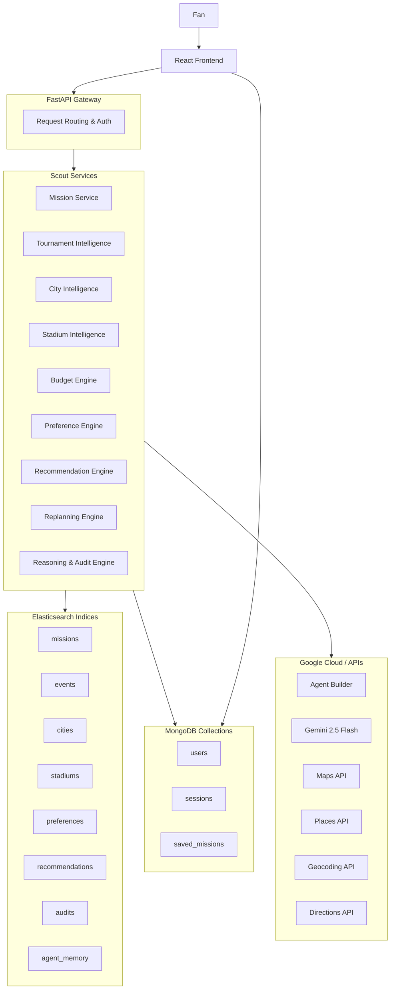

# ⚽ SKAUT: Adaptive Tournament Intelligence Platform

> **Mission In. Intelligence Out.**
>
> Skaut is an AI-powered tournament intelligence platform that helps fans follow their team through uncertain tournaments such as the FIFA World Cup 2026.
>
> Built for the **Google Cloud Rapid Agent Hackathon 2026**.

---

## 🚀 The Problem & Our Solution

### The Problem
The FIFA World Cup is unpredictable. Teams advance, match venues change, ticket and travel costs spike, and hotel rooms vanish overnight. Traditional travel planning tools assume absolute certainty and force fans to manually rebuild itineraries from scratch when disruptions occur.

### Our Solution
Skaut treats travel planning as a **living mission**. The user defines their team, budget, travel style, and preferences. Skaut then:
1. Monitors tournament developments.
2. Tracks live mission states.
3. Automatically detects disruptive events (e.g., team advancement or rescheduling).
4. Re-evaluates travel, lodging, and match options.
5. Generates deterministic, budget-constrained recommendations.
6. Explains every recommendation with a clear audit trail.

---

## 🏗️ System Architecture

Scout uses a decoupled service-oriented architecture where the FastAPI gateway routes requests to backend services, while Elasticsearch acts as the primary search and vector storage engine.



---

## 🤖 Agent & MCP Architecture

Google Cloud Agent Builder orchestrates workflows. Agent Builder accesses the underlying Scout database and services through the Model Context Protocol (MCP) layer.

```text
Elastic Agent Builder
        │
        ▼
FastMCP Server / Tool Registry (backend/app/mcp/server.py)
        │
        ▼
MCP Read-Only Tools (backend/app/mcp/tools/*)
        │
        ▼
Typed Scout Service Facades
        │
        ▼
Existing Scout Services ──► Elasticsearch & MongoDB
```

### Core Architecture Principles
* **Separation of Concerns:** Agent Builder manages workflow coordination and memory but holds zero business logic. Scout owns all tournament, preference, budget, and recommendation intelligence.
* **Read-Only Tools:** All MCP tools exposed to Agent Builder are read-only. Chat history and session tokens are never saved to the agent's memory.
* **Deterministic Fallbacks:** If the Agent Builder runtime fails, the application automatically falls back to built-in frontend/backend routes.

---

## 🔍 MCP Tool Catalog

Scout exposes 12 read-only tools to the Agent Builder via the Model Context Protocol:

| Tool | Service Boundary | Output Description |
|---|---|---|
| `get_mission(team)` | `mission_service` | Retrieves the latest active mission for a team. |
| `get_mission_history(team, size)` | `mission_service` | Lists historical changes to the team's mission. |
| `search_cities(query, size)` | `city_service` | Performs vector search over candidate cities. |
| `get_city(city)` | `city_service` | Retrieves detailed metadata and coordinates for a city. |
| `search_stadiums(query, size)` | `stadium_service` | Performs fuzzy multi-match over tournament stadiums. |
| `get_stadium(stadium)` | `stadium_service` | Retrieves details for a specific tournament stadium. |
| `get_budget(team)` | `budget_service` | Evaluates current expenditures and budget status. |
| `get_team_status(team)` | `tournament_service` | Returns the team's standing and tournament progress. |
| `get_tournament_state(team)` | `tournament_service` | Retrieves overall match layouts and upcoming games. |
| `get_recommendation(team)` | `recommendation_service` | Returns current travel/match recommendation data. |
| `get_reasoning(team)` | `reasoning_service` | Provides Gemini-generated plain text explanation. |
| `get_audit(team)` | `audit_service` | Returns the underlying scoring audit records. |

---

## 🧠 Recommendation & Audit Pipeline

Scout guarantees transparency. Recommendations are not hallucinated by LLMs; they are computed deterministically, scored against fan preferences, and analyzed for budget compatibility.

```text
Mission Data
    │
    ▼
Semantic Retrieval (Retrieve cities, stadiums, and alternative routes)
    │
    ▼
Candidate Enrichment (Inject travel costs, flight times, and hotel availability)
    │
    ▼
Preference Scoring (Compute weighted scores for transport, atmosphere, and cost)
    │
    ▼
Budget Analysis (Filter out options violating absolute cost constraints)
    │
    ▼
Decision Engine (Sort and select the optimal travel recommendation)
    │
    ▼
Reasoning Service (Send the structured audit trail to Gemini for narrative generation)
    │
    ▼
Final Recommendation (Presented to user with a complete, traceable score breakdown)
```

---

## 🗺️ Travel Intelligence Layer

Scout uses abstract provider models to query flights, hotels, ground transport, and match tickets. This decouples the core recommendation engine from third-party vendor lock-in.

```text
                  ┌───────────────────────┐
                  │ Travel Service Facade │
                  └───────────┬───────────┘
                              │
                    ┌─────────┴─────────┐
                    ▼                   ▼
          ┌───────────────────┐ ┌───────────────┐
          │ TravelProvider Ab │ │ Maps/Places Ab│
          └─────────┬─────────┘ └───────┬───────┘
                    │                   │
         ┌──────────┼──────────┐        ├── Geocoding API
         ▼          ▼          ▼        ├── Directions API
      [Amadeus] [Skyscanner]  [Mock]    └── Places API
```

* **Flights:** Interfaces with Amadeus (schedules, prices) and Skyscanner (deep-links).
* **Ground Transport:** Ready for FlixBus (bus routing) and Busbud (carrier aggregation).
* **Hotels:** Unified interface to search Booking.com and Expedia Rapid APIs.
* **Ticketing:** Integration templates for Ticketmaster and StubHub.

---

## 🔒 Security & Authentication Architecture

Scout's future security design relies on modern, stateless sessions:
* **Google OAuth 2.0:** Single-page React client login using Authorization Code Flow with PKCE.
* **Email + Password:** Traditional login using `bcrypt` (salt rounds = 12) for secure password hashing.
* **Magic Link:** Passwordless authentication using single-use, high-entropy tokens valid for 15 minutes.
* **Token Storage:** Stateless JSON Web Tokens (JWT) stored in HTTP-Only, SameSite=Lax, Secure cookies, preventing cross-site scripting (XSS) theft.

---

## 📊 Data Architecture

### Elasticsearch (Source of Truth)
Holds all search indices, travel data, preferences, and agent memory.
* **Missions Index:** Tracks team, budget, style, and active step.
* **Agent Memory Index:** Store summary-only memory records (`mission_summary`, `recommendation_summary`, `reasoning_summary`). Secrets and user sessions are never saved.

### MongoDB
Used strictly for light relational storage:
* **Users:** User profiles, credential records.
* **Sessions:** Active UI sessions.
* **Saved Missions:** Historical snapshots saved by the user.

---

## 🛠️ Local Installation & Configuration Setup

### Prerequisites
* **Python 3.11+**
* **Node.js 18+**
* **Elasticsearch 8.x** (Local or Elastic Cloud)
* **MongoDB 6.0+**

### 1. Clone & Set Up Environments
Create `.env` files in both directories using templates.

```bash
# Backend Setup
cd backend
python -m venv venv
.\venv\Scripts\activate
pip install -r requirements.txt
```

### 2. Configure Environment Variables

#### Backend Environment (`backend/.env`)
```ini
# Core Configuration
PORT=8000
HOST=0.0.0.0
CORS_ORIGINS=http://localhost:5173

# Elasticsearch Configuration
ELASTIC_CLOUD_ID=your-elastic-cloud-id
ELASTIC_USERNAME=elastic
ELASTIC_PASSWORD=your-elastic-password

# MongoDB Configuration
MONGODB_URI=mongodb://localhost:27017/scout

# Google Cloud Integrations
GEMINI_API_KEY=your-gemini-api-key
GOOGLE_MAPS_API_KEY=your-google-maps-api-key
```

#### Frontend Environment (`frontend/.env`)
```ini
VITE_API_BASE_URL=http://localhost:8000
VITE_GOOGLE_MAPS_API_KEY=your-google-maps-api-key
```

---

## 🚀 Running the Application

### 1. Ingest Initial Data
Populate Elasticsearch with host cities, stadiums, and tournament templates:
```bash
cd backend
# Run database indexes and data load scripts
python -m app.services.create_indices
python -m app.services.load_cities
python -m app.services.load_stadiums
python -m app.services.load_matches
python -m app.services.load_alternatives
python -m app.services.create_agent_memory_index
```

### 2. Run the Backend Server
```bash
python main.py
```
* **FastAPI Docs:** `http://localhost:8000/docs`
* **MCP Health Endpoint:** `http://localhost:8000/health/mcp`

### 3. Run the Frontend Server
```bash
cd frontend
npm install
npm run dev
```
* **Frontend UI:** `http://localhost:5173`

---

## ☁️ Production Deployment (Cloud Run)

### Backend Deployment
Deploy the FastAPI backend to Google Cloud Run:
```bash
cd backend
# Build image using Docker
docker build -t gcr.io/your-project-id/scout-backend .
docker push gcr.io/your-project-id/scout-backend
# Deploy to Cloud Run
gcloud run deploy scout-backend \
  --image gcr.io/your-project-id/scout-backend \
  --platform managed \
  --region us-central1 \
  --allow-unauthenticated
```

### Frontend Deployment
Deploy the Vite frontend static container (served via Nginx):
```bash
cd frontend
# Build image
docker build -t gcr.io/your-project-id/scout-frontend .
docker push gcr.io/your-project-id/scout-frontend
# Deploy to Cloud Run
gcloud run deploy scout-frontend \
  --image gcr.io/your-project-id/scout-frontend \
  --platform managed \
  --region us-central1 \
  --allow-unauthenticated
```

---

## 🧪 Verification & Health Checks

Verify that all systems are operational with these diagnostic endpoints:

```bash
# Check FastAPI API status
curl http://localhost:8000/health

# Check Datastore connectivity (Elasticsearch + MongoDB)
curl http://localhost:8000/readiness

# Check registered MCP Tools listing
curl http://localhost:8000/health/mcp
```

Validate the code builds cleanly:
* **Backend compilation test:** `python -m compileall -q backend`
* **Frontend Vite build test:** `cd frontend && npm run build`
